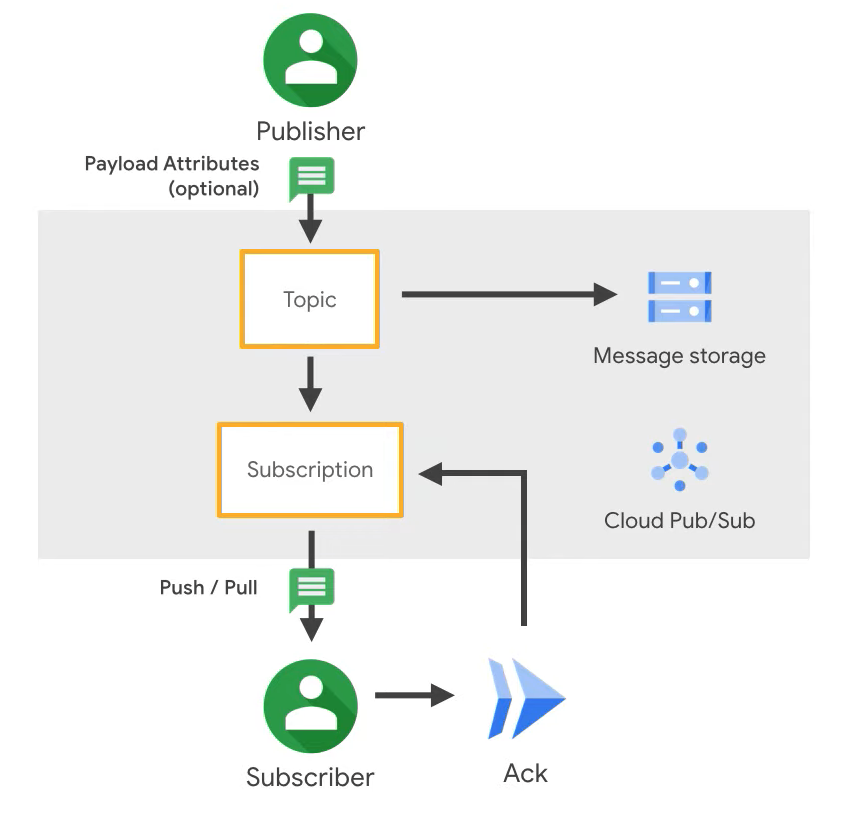
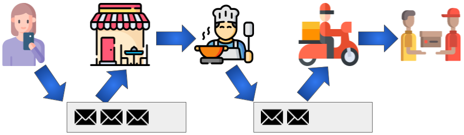
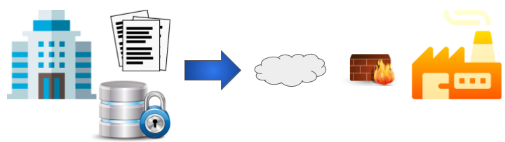
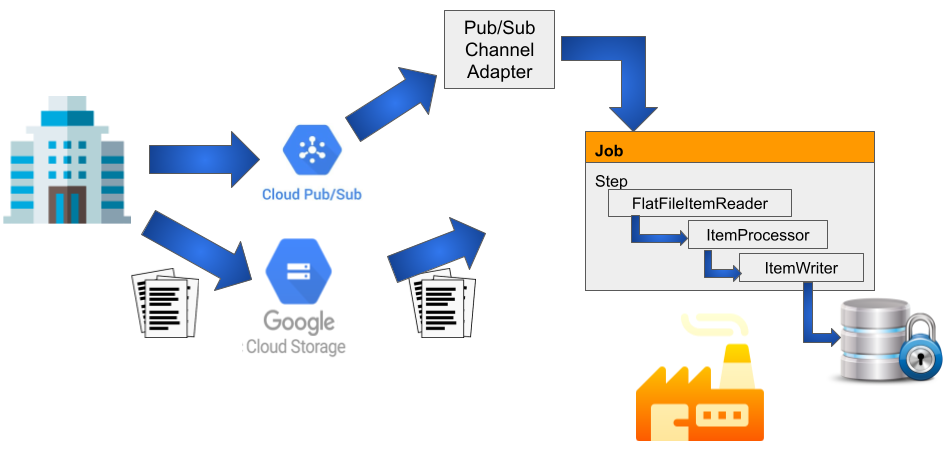

# Consuming GCP PubSub messages with Spring batch

---

## Jose Granados

### Software Developer Architect
<!-- .slide: style="text-align: left;"> -->
<i class="fab fa-twitter"></i><a href="https://twitter.com/ppgranados">  @ppgranados</a> 
<i class="fas fa-envelope"></i>  pp.granados@gmail.com 
<i class="fab fa-github"></i><a href="https://github.com/ppgranados">  github.com/ppgranados</a>

---

## Agenda
<!-- .slide: style="text-align: left;"> -->
- GPC Pub/Sub 
- Spring Batch 
- Use case: Food Delivery application 
- Use case: Sharing data between companies 

---

# GPC Pub/Sub
<!-- .slide: style="text-align: left;"> -->
Cloud Pub/Sub is a fully managed real-time messaging service that allows you to send and receive messages between independent applications.

"Pub/Sub allows services to communicate asynchronously, with latencies on the order of 100 milliseconds" 

---

# GPC Pub/Sub
<!-- .slide: style="text-align: left;"> -->

---

## Spring Batch
<!-- .slide: style="text-align: left;"> -->
Framework to create batch processing applications, provides reusable functions that are essential in processing large volumes of records, including logging/tracing, transaction management, job processing statistics, job restart, skip, and resource management.

 
Batch processing is used to process billions of transactions every day for enterprises.

---

## Spring Batch Features
<!-- .slide: style="text-align: left;"> -->
- Transaction management
- Chunk based processing
- Declarative I/O
- Start/Stop/Restart
- Retry/Skip
- Web based administration interface

---

## Spring Batch key concepts
<!-- .slide: style="text-align: left;"> -->

- Jobs
- Steps
- Readers
- Writers
- Listeners

---

## Spring Batch key concepts
<!-- .slide: style="text-align: left;"> -->

---

## Use case: Food Delivery application
<!-- .slide: style="text-align: left;"> -->

---

## Use case: Food Delivery application
<!-- .slide: style="text-align: left;"> -->

---

## Use case: Sharing data between companies
<!-- .slide: style="text-align: left;"> -->

---

## Use case: Sharing data between companies
<!-- .slide: style="text-align: left;"> -->

---

## Thanks!
<!-- .slide: style="text-align: left;"> -->
Resources:

<a href="https://spring.io/guides/gs/messaging-gcp-pubsub">https://spring.io/guides/gs/messaging-gcp-pubsub</a> 
<a href="https://cloud.google.com/pubsub/docs/spring">https://cloud.google.com/pubsub/docs/spring</a> 
<a href="https://spring.io/guides/gs/batch-processing/">https://spring.io/guides/gs/batch-processing/</a>

